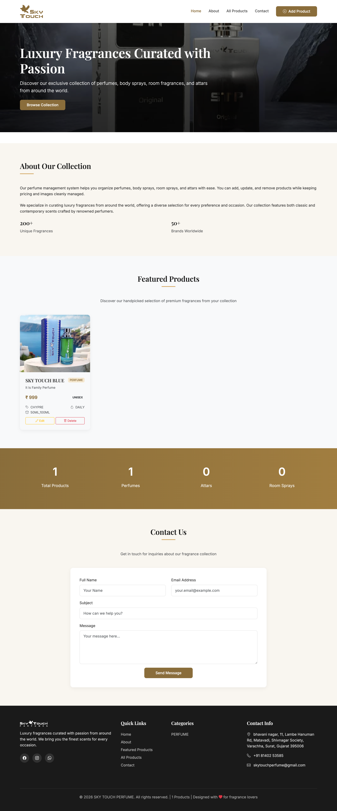
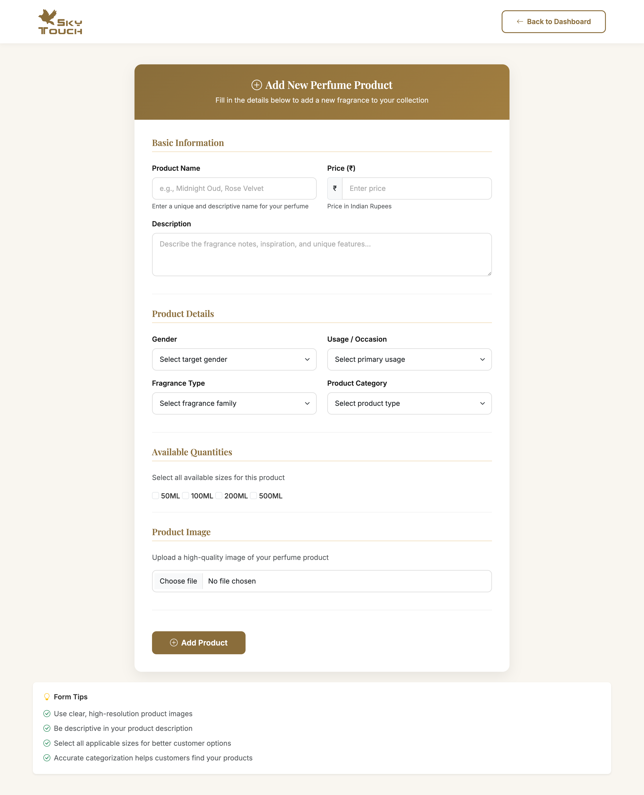
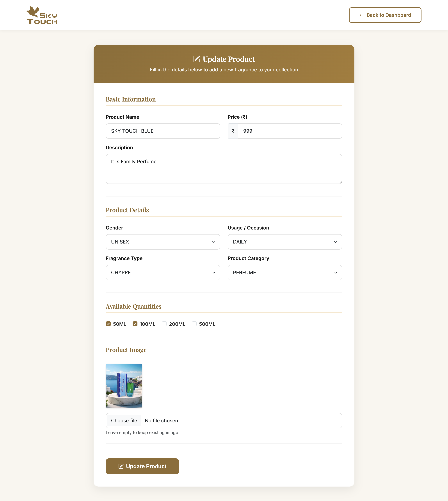

# 🌸 Sky Touch Perfume – Product Management System

A modern **Perfume Product Management System** built with **Node.js, Express, MongoDB, and EJS**.
This project provides a clean admin dashboard to manage perfume products efficiently.

---

## 📌 Project Overview

Sky Touch Perfume is a web-based product management application designed to handle perfumes, attars,
body sprays, and room sprays. Admins can add, edit, view, and delete products with images and detailed attributes.

---

## ✨ Features

- Add new perfume products
- Edit existing products
- Delete products with image cleanup
- Image upload support (Multer)
- Product categories (Perfume, Attar, Body Spray, Room Spray)
- Gender, usage, fragrance type, and size selection
- Responsive UI using Bootstrap 5
- Indian currency formatting (₹)

---

## 🛠 Tech Stack

- Backend: Node.js, Express.js
- Database: MongoDB
- Template Engine: EJS
- Styling: Bootstrap 5, Custom CSS
- File Upload: Multer

---

## 📂 Folder Structure

project-root/
│
├── models/
│   └── Product.model.js
│
├── controllers/
│   └── product.controller.js
│
├── routes/
│   └── index.js
│
├── views/
│   ├── ProductView.ejs
│   ├── ProductForm.ejs
│   └── ProductEdit.ejs
│
├── public/
│   ├── css/
│   ├── images/
│   └── uploads/
│
├── app.js
├── package.json
└── README.md

---

## 📸 Screenshots

### Product Dashboard

### Add Product Page

### Edit Product Page

> Create a folder named `screenshots` in the root directory and place your images there.

---

## 🚀 Installation & Run

1. Clone the repository
   git clone https://github.com/CodeWithRushii/NODE-JS/tree/main/PR-5

2. Navigate to PR-5 folder

3. Install dependencies
   npm install

4. Start MongoDB

5. Run the project
   npm start

6. Open in browser
   http://localhost:9080

---

## 📄 License

This project is licensed under the MIT License.

---

## ❤️ Author

Rushi Dedaniya
