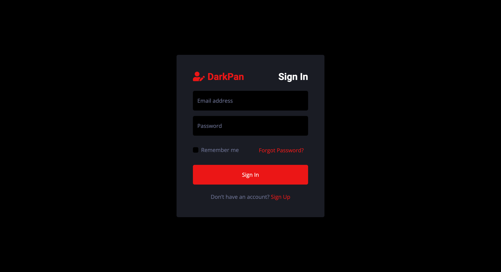
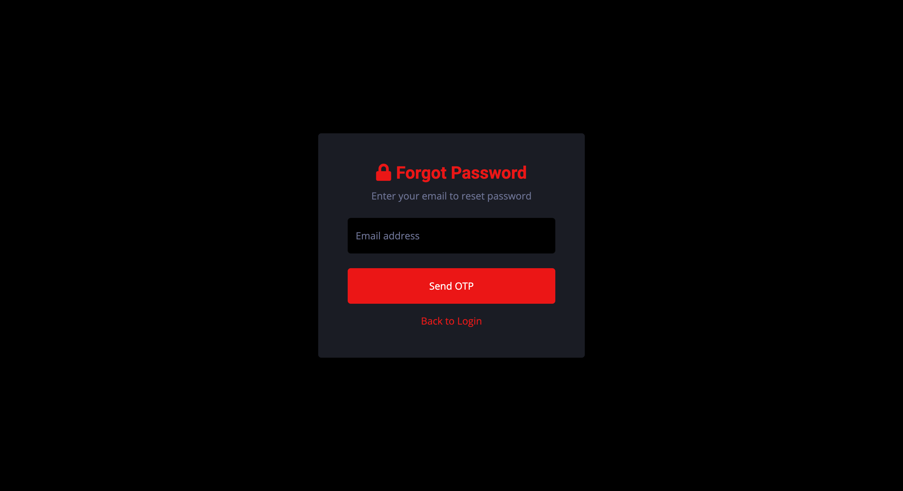
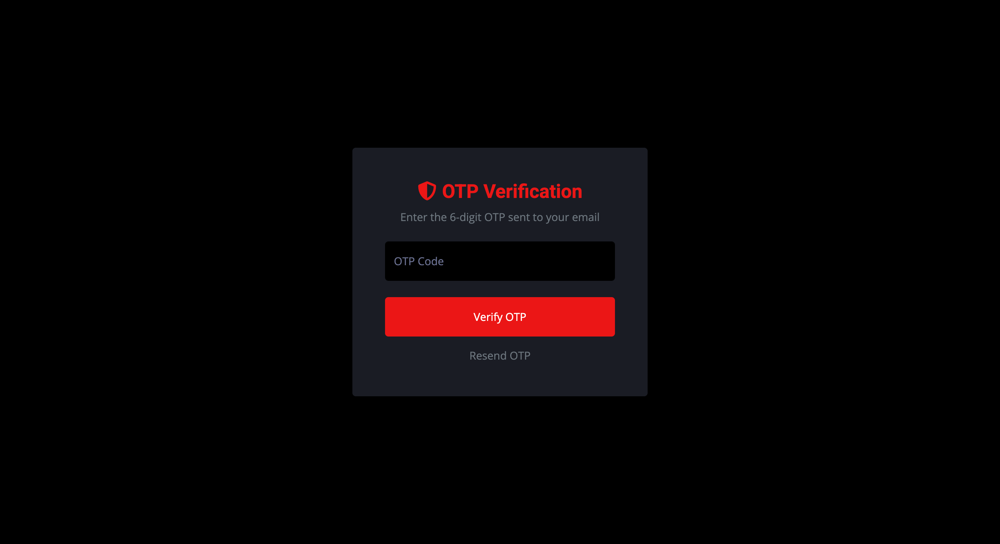
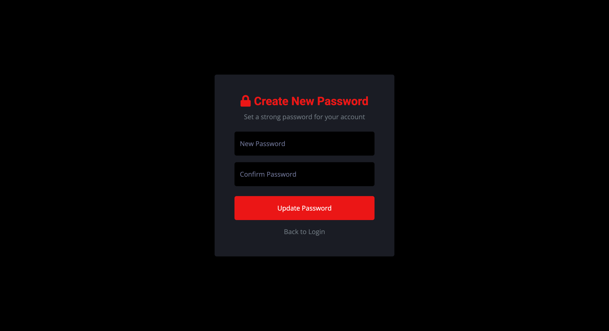
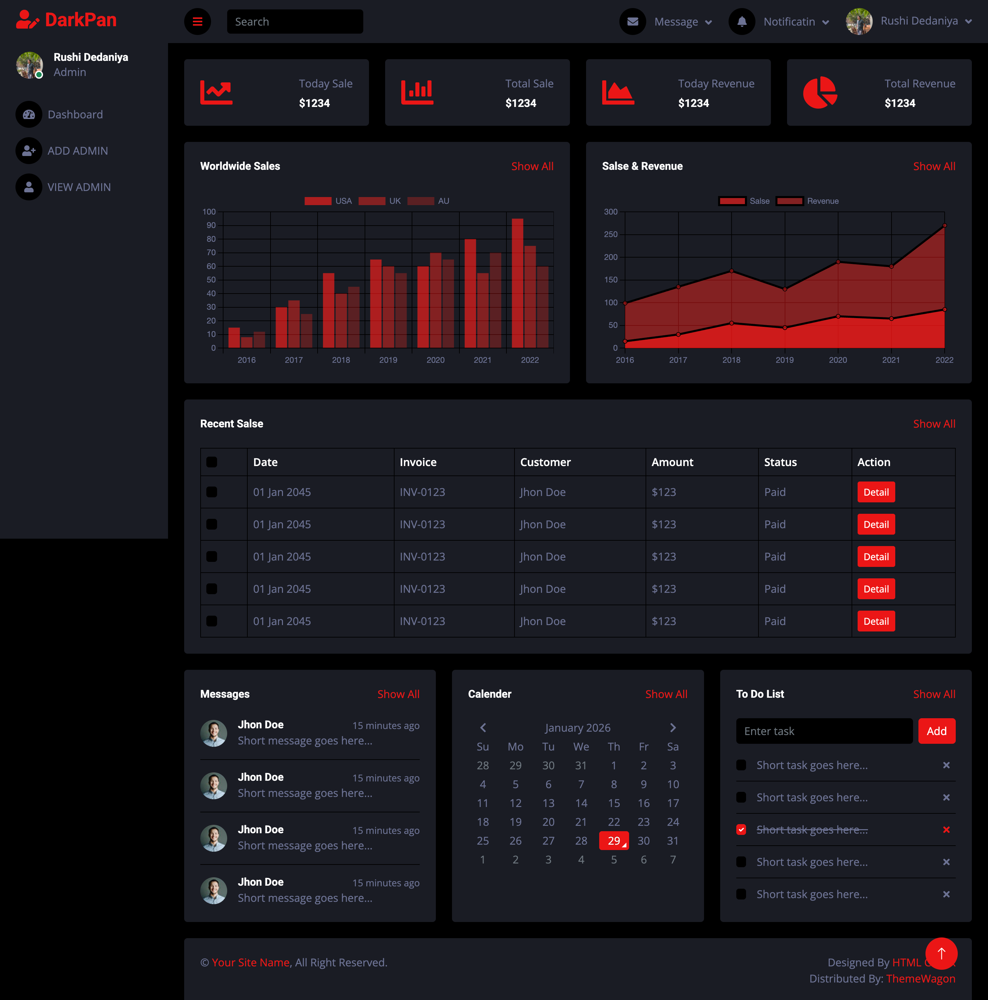
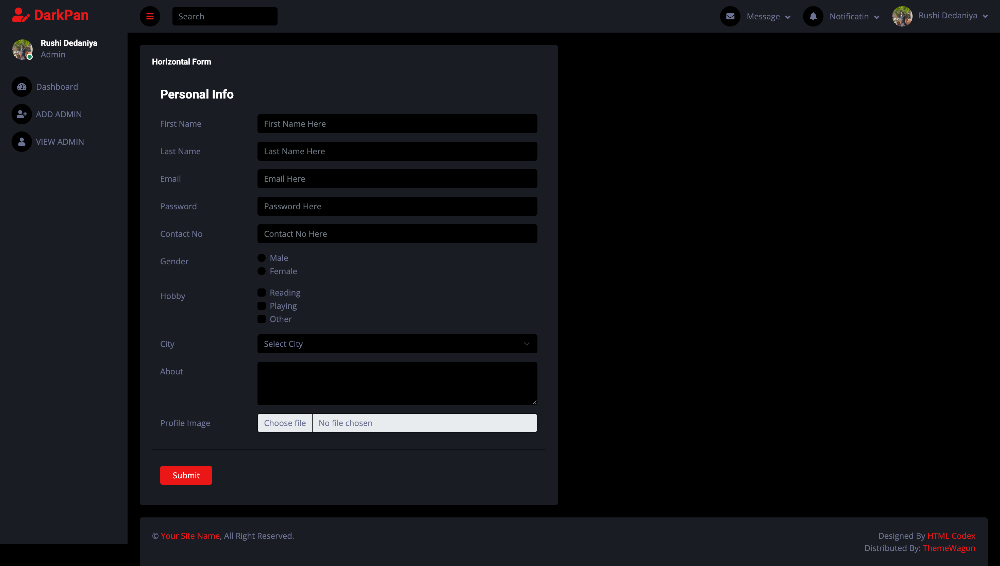
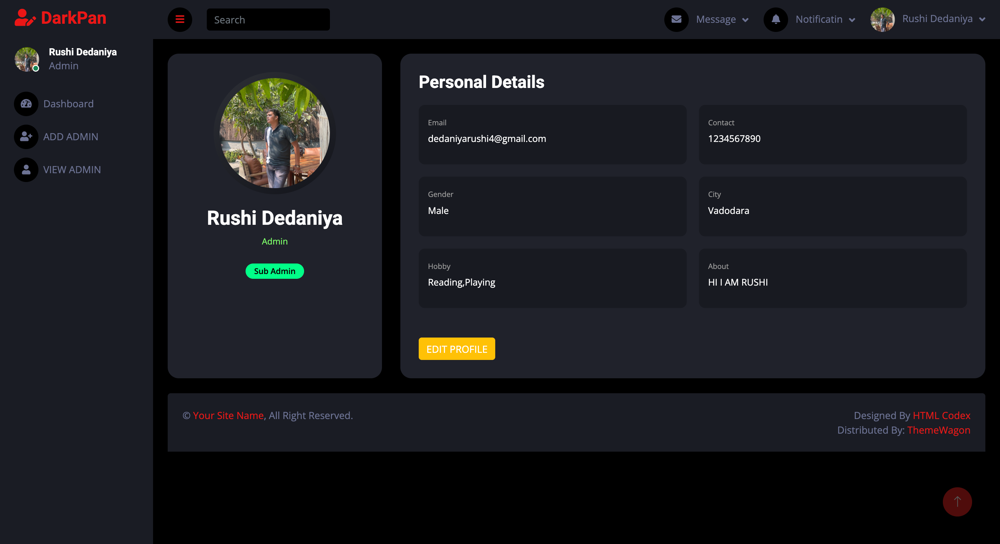
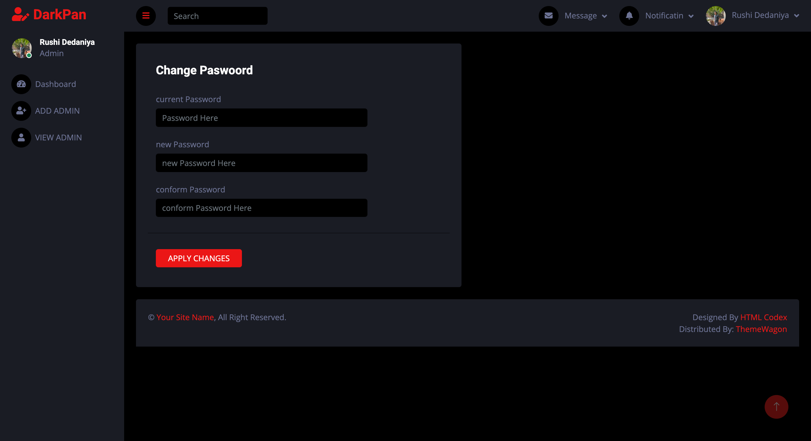
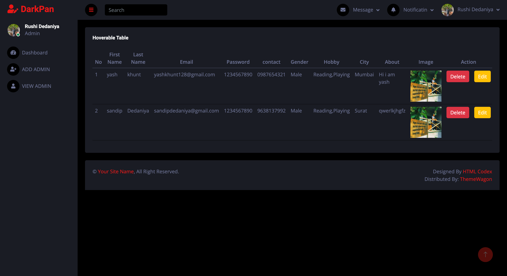

# Admin Panel – DarkPan

A complete **Admin Panel** built using **Node.js, Express, MongoDB, and EJS**.
This project includes authentication, OTP-based password recovery, admin management,
and a modern dark UI dashboard.

---

## 🚀 Features

- Admin Login & Logout
- Forgot Password with Email OTP
- OTP Verification
- Create New Password
- Dashboard with charts & widgets
- Add / View / Edit / Delete Admin
- My Profile page
- Change Password
- Profile Image Upload
- Role-based access (Main Admin / Sub Admin)
- Reusable Header & Footer (`header.ejs`, `footer.ejs`)

---

## 🛠 Tech Stack

- **Backend:** Node.js, Express
- **Frontend:** EJS, Bootstrap 5
- **Database:** MongoDB
- **Auth:** Cookies, Sessions
- **OTP:** Email-based verification
- **File Upload:** Multer

---

## 📂 Project Structure

```
views/
├── header.ejs
├── footer.ejs
├── dashboard.ejs
├── auth/
│   ├── login.ejs
│   ├── OTPPage.ejs
│   └── newPasswordPage.ejs
├── admin/
│   ├── addAdminPage.ejs
│   ├── editAdminPage.ejs
│   ├── viewAdminPage.ejs
│   ├── myprofile.ejs
│   └── changepassword.ejs
```

---

## 🧩 Layout Usage

```ejs
<%- include('../header') %>
<!-- Page Content -->
<%- include('../footer') %>
```

---

## 📸 Screenshots

> Create a folder named **screenshots/** in your project root and add these images.

### 🔐 Login Page


### 🔑 Forgot Password


### 🔢 OTP Verification


### 🔐 Create New Password


### 📊 Dashboard


### ➕ Add Admin


### 👤 My Profile


### 🔁 Change Password


### 📋 View Admin


---

## ⚙️ Installation & Run

```bash
npm install
npm start
```

Make sure MongoDB is running and environment variables are configured.

---

## 👑 Admin Roles

**Main Admin**
- Full access
- Can delete admins

**Sub Admin**
- Limited access
- Cannot delete admins

---

## 📄 License

This project is for learning and internal use only.

---

## 👨‍💻 Author

**Rushi Dedaniya**
