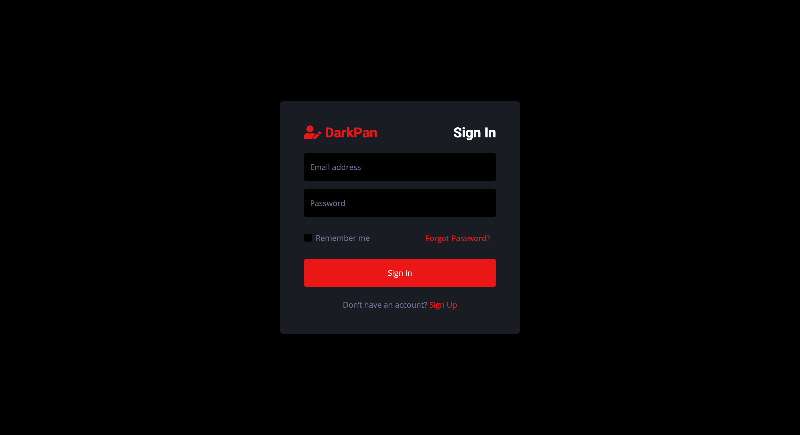
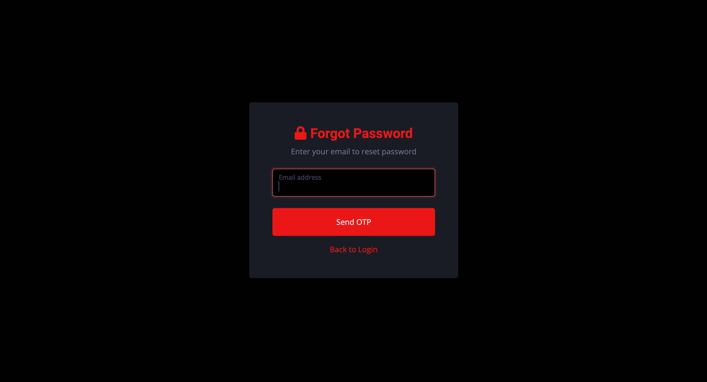
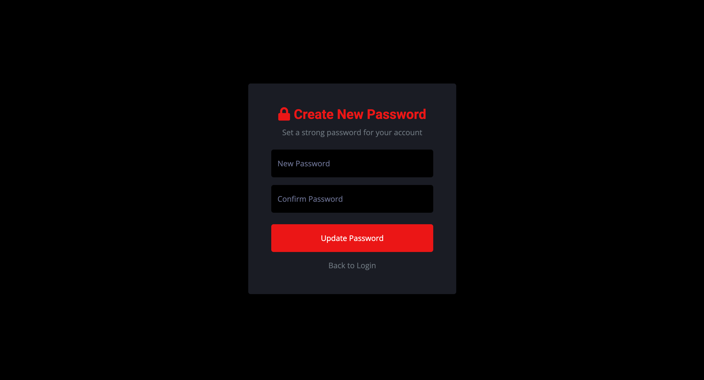
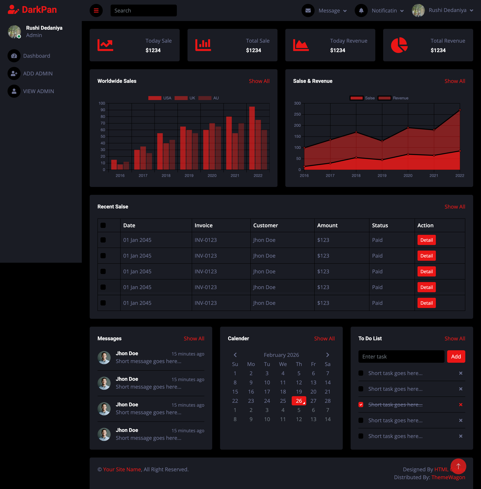
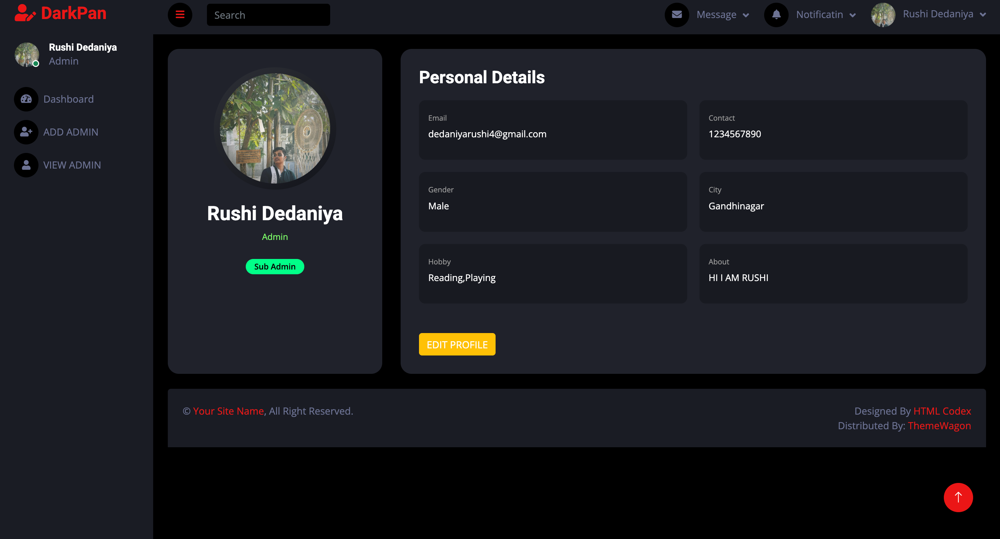
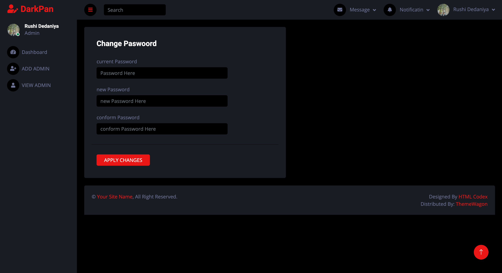
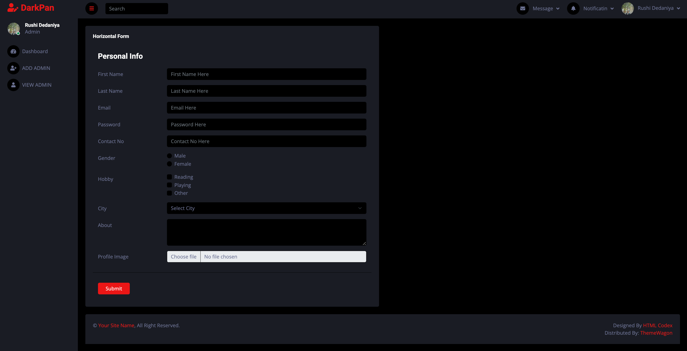
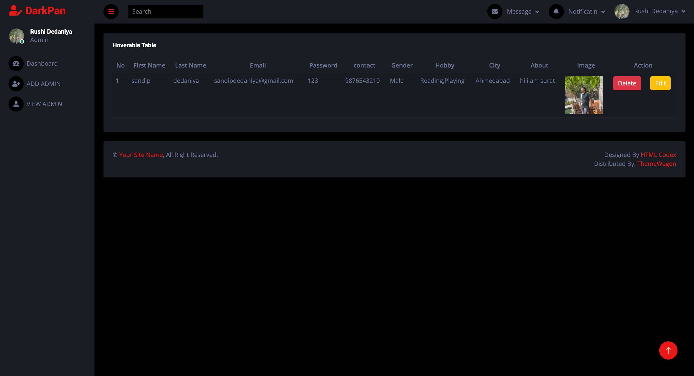
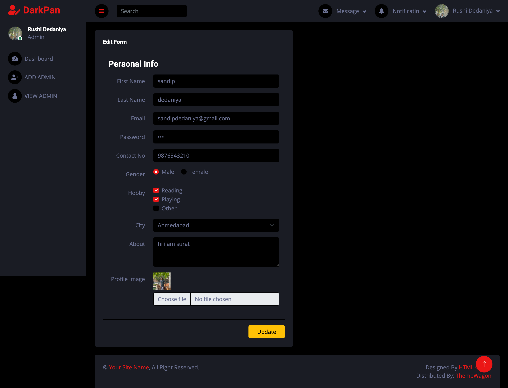

# Admin Panel

A full-stack Admin Panel application built with Node.js, Express, MongoDB, and EJS templating engine. Features authentication, CRUD operations, image upload, and email notifications.

## Features

- **User Authentication**: Secure login system using Passport.js with local strategy
- **Session Management**: Express sessions with cookie-based authentication
- **Flash Messages**: User feedback notifications using connect-flash
- **File Uploads**: Image upload functionality with Multer
- **Email Notifications**: Email sending capability using Nodemailer
- **MongoDB Database**: Data persistence with Mongoose ODM
- **Responsive UI**: Server-side rendered views with EJS templates

## Screenshots

### Login Page


### Reset Password Email Page


### OTP Verification Page


### Reset Password Page


### Dashboard Page


### Profile Page


### Change Password Page


### Add Admin Page


### View Admin Page


### Edit Admin Page



> **Note**: Add your screenshots to a `screenshots/` folder in the project root and update the paths above if needed.

## Tech Stack

- **Backend**: Node.js, Express.js
- **Database**: MongoDB with Mongoose
- **Authentication**: Passport.js (Local Strategy)
- **Template Engine**: EJS
- **Session**: express-session
- **File Upload**: Multer
- **Email**: Nodemailer
- **Development**: Nodemon

## Prerequisites

- Node.js (v14 or higher)
- MongoDB (local or cloud instance)
- npm or yarn package manager

## Installation

1. Clone the repository:
```bash
git clone <repository-url>
cd PR-7
```

2. Install dependencies:
```bash
npm install
```

3. Set up environment variables (create a `.env` file in the root directory):
```env
PORT=9080
MONGODB_URI=your_mongodb_connection_string
SESSION_SECRET=your_session_secret
EMAIL_SERVICE=your_email_service
EMAIL_USER=your_email_username
EMAIL_PASS=your_email_password
```

4. Ensure MongoDB is running on your system or configure a cloud connection in `config/db.config.js`

## Usage

Start the development server:
```bash
npm start
```

The application will be available at: `http://localhost:9080`

## Project Structure

```
PR-7/
├── config/              # Configuration files
│   └── db.config.js     # Database connection setup
├── controllers/         # Route controllers
│   └── admin.controller.js
├── Middleware/          # Custom middleware
│   ├── connectFlash.middleware.js
│   └── passport.local.middleware.js
├── model/               # Database models
│   └── admin.model.js
├── public/              # Static assets (CSS, JS, images)
├── routes/              # Application routes
│   └── index.js
├── uploads/             # Uploaded files storage
├── views/               # EJS templates
├── server.js            # Application entry point
└── package.json         # Dependencies and scripts
```

## Routes

- `GET /` - Home/Dashboard page
- `GET /login` - Login page
- `POST /login` - Login authentication
- `GET /logout` - Logout
- Various admin routes for CRUD operations

## Dependencies

| Package | Version | Purpose |
|---------|---------|---------|
| express | ^5.2.1 | Web framework |
| mongoose | ^9.1.1 | MongoDB ODM |
| ejs | ^3.1.10 | Template engine |
| passport | ^0.7.0 | Authentication |
| passport-local | ^1.0.0 | Local auth strategy |
| express-session | ^1.19.0 | Session management |
| connect-flash | ^0.1.1 | Flash messages |
| multer | ^2.0.2 | File upload handling |
| nodemailer | ^7.0.12 | Email sending |
| cookie-parser | ^1.4.7 | Cookie parsing |
| toastify-js | ^1.12.0 | Toast notifications |
| nodemon | ^3.1.11 | Development auto-reload |

## Development

The project uses Nodemon for automatic server restart during development. Any changes to the code will automatically restart the server.

## Session Configuration

Sessions are configured with:
- **Name**: DarkAdminPanelSession
- **Cookie Max Age**: 24 hours (1000 * 60 * 60 * 24 ms)
- **Secret**: Configured in session middleware

## Contributing

1. Fork the repository
2. Create your feature branch (`git checkout -b feature/amazing-feature`)
3. Commit your changes (`git commit -m 'Add some amazing feature'`)
4. Push to the branch (`git push origin feature/amazing-feature`)
5. Open a Pull Request

## License

This project is licensed under the ISC License.

## Author

Created for Chapter 12 Admin Panel project.
